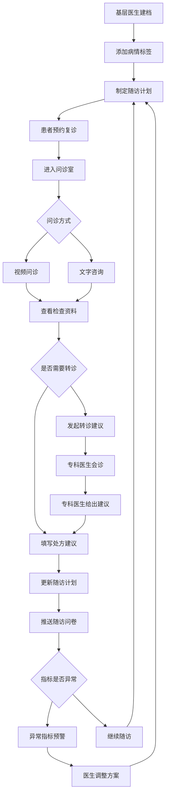

## 1. 产品概述

远程复诊服务台是一个面向基层医生、专科医生和慢病患者的线上随访 Web 平台，旨在打破地域限制，实现患者全周期慢病管理。通过数字化问诊、智能随访、指标监测等核心能力，提升基层医疗服务质量与专科资源下沉效率。

- 核心目标：构建"基层首诊→线上复诊→专科转诊"的闭环随访体系，降低慢病患者脱落率
- 市场价值：赋能基层医生获取专科指导，减少患者往返就医成本，实现医疗资源高效配置

## 2. 核心功能

### 2.1 用户角色

| 角色 | 注册方式 | 核心权限 |
|------|----------|----------|
| 基层医生 | 医师资格认证注册 | 患者建档、发起复诊、查看病历、转诊申请、文字/视频问诊 |
| 专科医生 | 医师资格认证注册 | 接收转诊、会诊意见、处方建议、随访问卷管理、异常指标审核 |
| 慢病患者 | 手机号/身份证注册 | 预约复诊、上传检查资料、查看处方、用药提醒、服务评价 |

### 2.2 功能模块

1. **患者列表页**：患者搜索筛选、患者建档、病情标签管理、异常指标预警提示
2. **问诊室页**：视频问诊入口、文字咨询、图片上传、处方建议记录、医生转诊建议
3. **病历页**：历史病历查看、病程记录、诊断信息、治疗方案
4. **检查资料页**：图片上传、检查报告整理、报告分类查看、异常指标标注
5. **用药页**：用药清单、用药提醒、处方建议记录、药物交互提示
6. **随访计划页**：随访问卷、预约复诊、指标趋势图、异常指标预警、患者教育资料
7. **消息页**：系统通知、问诊消息、转诊通知、费用确认、服务评价

### 2.3 页面详情

| 页面名称 | 模块名称 | 功能描述 |
|----------|----------|----------|
| 患者列表 | 搜索筛选栏 | 按姓名、病种、标签、异常状态等条件筛选患者 |
| 患者列表 | 患者卡片列表 | 展示患者头像、姓名、病种标签、最近随访日期、异常指标预警标记 |
| 患者列表 | 新建患者弹窗 | 填写基本信息、既往病史、过敏史，支持病情标签选择 |
| 患者列表 | 病情标签管理 | 添加/编辑/删除自定义标签，系统预设常见慢病标签 |
| 患者列表 | 异常指标预警 | 红色/橙色标记异常指标患者，点击查看异常详情 |
| 问诊室 | 视频问诊入口 | 一键发起/加入视频通话，显示通话状态与时长 |
| 问诊室 | 文字咨询区 | 实时文字消息收发，支持表情与快捷短语 |
| 问诊室 | 图片上传 | 拖拽/点击上传伤口照片、检查图片，支持预览与标注 |
| 问诊室 | 处方建议面板 | 医生填写处方建议，包含药品名称、剂量、用法、疗程 |
| 问诊室 | 转诊建议面板 | 基层医生向专科医生发起转诊，填写转诊原因与建议 |
| 病历 | 病历时间线 | 按时间倒序展示就诊记录，含诊断、处方、检查摘要 |
| 病历 | 病历详情 | 展示完整病历信息：主诉、现病史、既往史、诊断、治疗方案 |
| 病历 | 历史病历查看 | 按日期范围筛选历史病历，支持导出 |
| 检查资料 | 报告列表 | 按类型（血液/影像/心电图等）分类展示检查报告 |
| 检查资料 | 图片上传区 | 上传检查报告图片，支持批量上传与自动分类 |
| 检查资料 | 报告详情 | 查看报告图片与关键指标，异常值高亮标注 |
| 检查资料 | 报告整理 | 标记重要报告、添加备注、归档整理 |
| 用药 | 用药清单 | 当前用药列表：药品名、剂量、频次、开始/结束日期 |
| 用药 | 用药提醒设置 | 设置服药时间提醒，支持自定义提醒频次 |
| 用药 | 处方建议记录 | 记录医生处方变更历史，含调整原因 |
| 用药 | 药物交互提示 | 显示药物间潜在交互风险预警 |
| 随访计划 | 随访问卷 | 创建/填写随访问卷，支持自定义题型与评分 |
| 随访计划 | 预约复诊 | 选择日期时间预约下次复诊，支持日历视图 |
| 随访计划 | 指标趋势图 | 展示关键健康指标（血压、血糖等）趋势折线图 |
| 随访计划 | 异常指标预警 | 阈值设定与超标自动预警通知 |
| 随访计划 | 患者教育资料 | 推送疾病相关知识、生活方式指导文章 |
| 消息 | 系统通知 | 随访提醒、用药提醒、异常预警等系统消息 |
| 消息 | 问诊消息 | 问诊相关沟通消息记录 |
| 消息 | 转诊通知 | 转诊申请/接受/完成通知 |
| 消息 | 费用确认 | 复诊费用明细与确认 |
| 消息 | 服务评价 | 患者对问诊服务评分与评价提交 |

## 3. 核心流程

### 3.1 患者建档与首诊流程
基层医生为慢病患者创建档案，填写基本信息与病史，添加病情标签，完成首诊记录。

### 3.2 线上复诊流程
患者预约复诊 → 医生接受预约 → 进入问诊室（视频/文字） → 查看检查资料 → 填写处方建议 → 更新随访计划。

### 3.3 转诊流程
基层医生发起转诊 → 选择专科医生 → 填写转诊原因 → 专科医生接收 → 会诊并给出建议 → 回转基层医生继续随访。

### 3.4 随访管理流程
医生制定随访计划 → 系统按时推送随访问卷 → 患者填写 → 系统分析指标 → 异常预警通知医生 → 医生调整治疗方案。

## 4. 用户界面设计

### 4.1 设计风格

- **主色调**：医疗蓝 (#0A6EBD) + 健康绿 (#12B886)，传达专业与生命力
- **辅助色**：预警橙 (#FF922B)、危险红 (#FA5252)、中性灰 (#868E96)
- **按钮风格**：圆角 8px，主按钮实色填充，次按钮描边样式
- **字体**：标题使用 Noto Sans SC Medium 600，正文使用 Noto Sans SC Regular 400
- **字号层级**：页面标题 24px、卡片标题 16px、正文 14px、辅助文字 12px
- **布局风格**：左侧导航 + 右侧内容区，卡片式内容组织
- **图标风格**：线性图标（lucide-react），统一 20px 尺寸
- **圆角体系**：卡片 12px、按钮 8px、输入框 6px、头像 50%

### 4.2 页面设计概览

| 页面名称 | 模块名称 | UI 元素 |
|----------|----------|---------|
| 患者列表 | 搜索筛选栏 | 输入框 + 下拉筛选 + 标签筛选器，浅灰背景，固定顶部 |
| 患者列表 | 患者卡片 | 白底圆角卡片，左侧头像+姓名+标签，右侧异常标记+最近随访日期，hover 阴影提升 |
| 患者列表 | 新建患者弹窗 | 居中模态框，分步表单，进度指示器，底部操作按钮 |
| 患者列表 | 病情标签 | 彩色药丸标签，可点击筛选，预设 8 种慢病颜色 |
| 患者列表 | 异常预警标记 | 红色脉冲圆点 + 数量徽章，点击展开异常详情面板 |
| 问诊室 | 视频问诊 | 右侧大视频区 + 左下角小窗，底部控制栏（静音/摄像头/挂断），深色背景 |
| 问诊室 | 文字咨询 | 左侧消息列表，气泡样式（医生蓝色/患者灰色），底部输入框+发送按钮 |
| 问诊室 | 图片上传 | 虚线拖拽区域 + 网格预览，支持缩略图悬浮放大 |
| 问诊室 | 处方建议 | 右侧抽屉面板，表格形式药品列表，底部添加药品按钮 |
| 问诊室 | 转诊建议 | 弹窗表单，选择专科医生 + 转诊原因文本域 |
| 病历 | 时间线 | 左侧竖向时间轴，每个节点包含日期+摘要卡片，点击展开详情 |
| 病历 | 病历详情 | 全屏面板，分区展示（主诉/现病史/既往史/诊断/处方），分区标题加粗 |
| 病历 | 历史筛选 | 顶部日期范围选择器 + 导出按钮 |
| 检查资料 | 报告列表 | Tab 切换分类（血液/影像/心电图），每项含缩略图+报告名+日期+异常标记 |
| 检查资料 | 图片上传 | 拖拽区+点击上传，进度条显示，上传完成显示缩略图 |
| 检查资料 | 报告详情 | 左侧大图预览，右侧关键指标列表，异常值红色高亮 |
| 检查资料 | 整理操作 | 每个报告卡片右上角操作菜单（标记重要/添加备注/归档） |
| 用药 | 用药清单 | 表格样式，药品名称+剂量+频次+状态标签（进行中/已停用） |
| 用药 | 用药提醒 | 时间轴样式展示每日提醒节点，开关控制启用/停用 |
| 用药 | 处方记录 | 时间线展示处方变更，每次变更含调整项和调整原因 |
| 用药 | 交互提示 | 黄色警告横幅，列出交互药物对及风险等级 |
| 随访计划 | 随访问卷 | 卡片式问卷列表，状态标签（待填写/已完成/已过期），点击进入问卷 |
| 随访计划 | 预约复诊 | 日历视图，标记已有预约日期，点击日期创建预约 |
| 随访计划 | 指标趋势图 | Recharts 折线图，支持多指标叠加，鼠标悬浮显示数值 |
| 随访计划 | 异常预警 | 预警卡片列表，红/橙双色区分严重程度，阈值设置入口 |
| 随访计划 | 教育资料 | 卡片列表，缩略图+标题+摘要，点击展开全文 |
| 消息 | 消息分类 | 顶部 Tab（全部/系统/问诊/转诊/费用/评价） |
| 消息 | 消息列表 | 左侧消息列表，未读蓝点标记，右侧消息详情 |
| 消息 | 费用确认 | 费用明细表格，底部确认/申诉按钮 |
| 消息 | 服务评价 | 星级评分 + 标签选择 + 文本域，提交后显示感谢反馈 |

### 4.3 响应式设计

- 桌面优先设计，核心在 1440px 及以上宽度优化
- 1024px-1439px 适度收缩侧边栏为图标模式
- 768px 以下切换为底部 Tab 导航，内容区全宽
- 表格类内容在移动端转为卡片列表
- 视频问诊在移动端自适应为上下布局

### 4.4 无障碍

- 所有交互元素支持键盘导航
- 预警信息同时使用颜色与图标双重表达
- 表单字段均有关联 label
- 图片上传区提供替代文本输入
