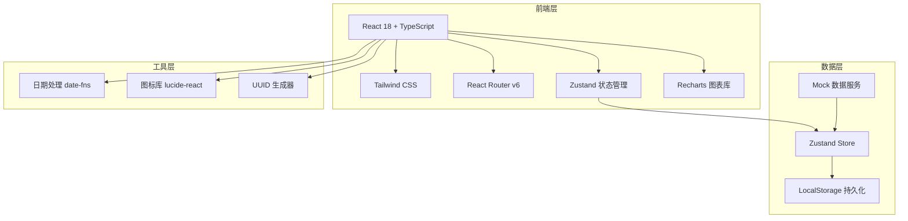
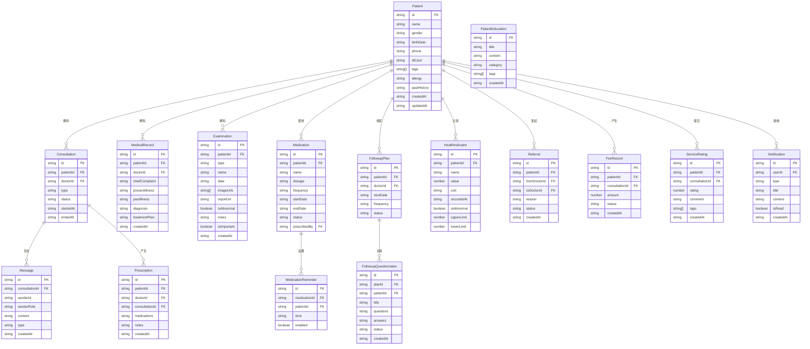

## 1. 架构设计



## 2. 技术说明

- **前端**：React@18 + TypeScript + Tailwind CSS@3 + Vite
- **初始化工具**：vite-init
- **后端**：无（纯前端项目，使用 Mock 数据）
- **数据库**：无（使用 Zustand Store + LocalStorage 模拟数据持久化）
- **路由**：React Router v6
- **状态管理**：Zustand
- **图表**：Recharts（指标趋势图）
- **图标**：lucide-react
- **日期处理**：date-fns

## 3. 路由定义

| 路由 | 用途 |
|------|------|
| `/` | 重定向到患者列表页 |
| `/patients` | 患者列表页：搜索筛选、患者卡片、建档、标签管理、异常预警 |
| `/consultation/:patientId` | 问诊室页：视频问诊、文字咨询、图片上传、处方建议、转诊建议 |
| `/records/:patientId` | 病历页：时间线、病历详情、历史筛选 |
| `/examinations/:patientId` | 检查资料页：报告列表、上传、详情、整理 |
| `/medications/:patientId` | 用药页：用药清单、提醒、处方记录、交互提示 |
| `/followup/:patientId` | 随访计划页：随访问卷、预约复诊、指标趋势图、异常预警、教育资料 |
| `/messages` | 消息页：系统通知、问诊消息、转诊通知、费用确认、服务评价 |

## 4. 数据模型

### 4.1 数据模型定义



## 5. 项目目录结构

```
src/
├── components/
│   ├── layout/
│   │   ├── Sidebar.tsx
│   │   ├── TopBar.tsx
│   │   └── AppLayout.tsx
│   ├── ui/
│   │   ├── Button.tsx
│   │   ├── Card.tsx
│   │   ├── Modal.tsx
│   │   ├── Badge.tsx
│   │   ├── Input.tsx
│   │   ├── Select.tsx
│   │   ├── Tabs.tsx
│   │   └── Avatar.tsx
│   └── shared/
│       ├── PatientCard.tsx
│       ├── HealthTrendChart.tsx
│       ├── AbnormalIndicator.tsx
│       └── ImageUploader.tsx
├── pages/
│   ├── Patients.tsx
│   ├── Consultation.tsx
│   ├── MedicalRecords.tsx
│   ├── Examinations.tsx
│   ├── Medications.tsx
│   ├── FollowupPlan.tsx
│   └── Messages.tsx
├── stores/
│   ├── patientStore.ts
│   ├── consultationStore.ts
│   ├── medicationStore.ts
│   ├── followupStore.ts
│   └── notificationStore.ts
├── data/
│   └── mockData.ts
├── types/
│   └── index.ts
├── hooks/
│   ├── usePatient.ts
│   └── useConsultation.ts
├── utils/
│   ├── date.ts
│   └── format.ts
├── App.tsx
├── main.tsx
└── index.css
```
